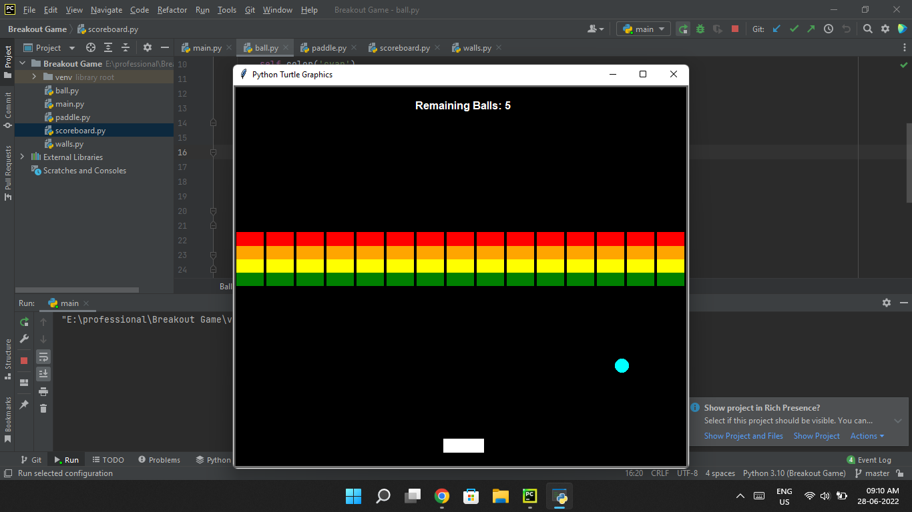

# Breakout-Game
Breakout was a hit game originally coded up by Steve Wozniak before he and Jobs started Apple. It's a simple game that is similar to Pong where you use a ball and paddle to break down a wall.


<h2>Run Script</h2>

```
git clone https://github.com/viralRupani/Breakout-Game
cd Breakout Game
python main.py
```

<h2>Example</h2>


<b><i>You will have 5 Chance to Break all Walls</i></b>

